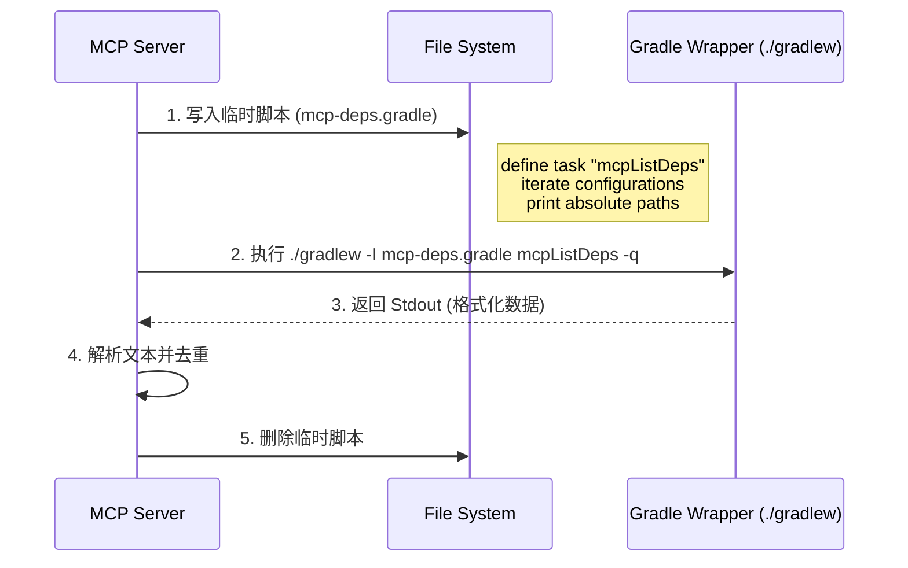

# Java Jar Viewer MCP - 技术设计文档

## 1. 项目概述 (Overview)

**Java Jar Viewer MCP** 是一个基于 [Model Context Protocol (MCP)](https://modelcontextprotocol.io/) 标准的服务器端应用。它的核心目标是赋予 LLM（如 Claude、Cursor 等）类似 IntelliJ IDEA 的能力，使其能够：
1.  **深入探索**：像浏览文件夹一样浏览编译好的 JAR 包内容。
2.  **反编译阅读**：自动将 `.class` 字节码反编译为 Java 源代码，并保留上下文。
3.  **智能关联**：优先寻找并挂载 `*-sources.jar` 源码包，提供包含注释的原始代码。
4.  **依赖解析**：自动分析本地 Maven/Gradle 项目，定位依赖库在磁盘上的绝对路径。

## 2. 技术栈选型 (Tech Stack)

*   **开发语言**: TypeScript (Node.js)
*   **协议实现**: `@modelcontextprotocol/sdk`
*   **分发方式**: `npm` / `npx` (Zero-config execution)
*   **核心依赖**:
    *   **ZIP 处理**: `adm-zip` (用于读取 JAR 归档)
    *   **反编译核心**: `CFR` (Java Decompiler, 以 jar 包形式内置于项目)
    *   **外部调用**: Node.js `child_process` (调用 `java`, `mvn`, `gradlew` 命令)

## 3. 系统架构 (Architecture)

系统采用 **分层架构**，分为接口层、业务逻辑层和基础设施层。

```mermaid
graph TD
    User[LLM Client (Claude/Cursor)] -- JSON-RPC --> MCP[MCP Server (Node.js)]
    
    subgraph "MCP Server Logic"
        Router[Tool Router]
        SrcDetector[Source Attach Logic]
        DepScanner[Dependency Scanner]
    end
    
    subgraph "Infrastructure"
        ZipLib[adm-zip]
        JavaRuntime[Local JRE]
        BuildTools[Maven / Gradle]
    end
    
    subgraph "File System"
        JarFile[Application Jar]
        SourceJar[Source Jar]
        CfrJar[Built-in CFR Tool]
    end

    MCP --> Router
    Router -- list_jar_entries --> ZipLib
    Router -- read_jar_entry --> SrcDetector
    Router -- scan_dependencies --> DepScanner
    
    SrcDetector -- 优先读取 --> SourceJar
    SrcDetector -- 降级反编译 --> JavaRuntime
    JavaRuntime -- 执行 --> CfrJar
    CfrJar -- 读取 --> JarFile
    
    DepScanner -- 调用 --> BuildTools
```

## 4. 核心工具定义 (Tool Definitions)

### 4.1. `list_jar_entries`
*   **描述**: 列出 JAR 包内的文件目录结构。
*   **输入参数**:
    *   `jarPath` (string): JAR 文件的本地绝对路径。
    *   `innerPath` (string, optional): 内部过滤路径（如 `org/springframework/`）。
*   **实现细节**:
    *   为防止 Token 溢出，结果需限制条目数量（如 Top 100）。
    *   支持简单的目录折叠显示。

### 4.2. `read_jar_entry`
*   **描述**: 读取 JAR 包内指定文件的内容。如果是 `.class` 文件，自动返回 Java 源码。
*   **输入参数**:
    *   `jarPath` (string): JAR 文件的本地绝对路径。
    *   `entryPath` (string): 内部文件路径（如 `com/example/Main.class`）。
*   **核心逻辑 (智能路由)**:
    1.  **源码探测**: 检查同目录下是否存在 `{name}-sources.jar`。
    2.  **路径映射**: 如果存在源码包，将请求的 `.class` 路径转换为 `.java` 路径。
    3.  **尝试读取源码**: 若成功，返回带有 `// Source: Attached` 注释的原始内容。
    4.  **降级反编译**: 若无源码，调用内置 CFR 工具：`java -jar cfr.jar {jarPath} {entryPath}`。
    5.  **资源回退**: 若非 class 文件（如 xml/properties），直接按文本读取。

### 4.3. `scan_project_dependencies`
*   **描述**: 扫描 Maven/Gradle 项目，解析所有依赖项的本地绝对路径。
*   **输入参数**:
    *   `projectPath` (string): 项目根目录（包含 pom.xml 或 build.gradle）。
*   **实现细节**:
    *   **项目类型判定**: 命令执行前从 `projectPath` 向上查找 `pom.xml` / `build.gradle(.kts)` / `settings.gradle(.kts)`，判定 `maven` / `gradle` / `native` 并定位 `projectRoot`，`mvn` 与 `gradle/gradlew` 命令会校验类型，不匹配直接报错。
    *   **Maven**: 执行 `mvn dependency:list -DoutputAbsoluteArtifactFilename=true ...` 并解析文本输出。
    *   **Gradle**:
        *   采用 **Init Script (初始化脚本)** 注入策略，确保对用户项目无侵入。
        *   运行时动态生成临时脚本，通过 `./gradlew --init-script mcp-init.gradle` 执行任务，输出所有 Configuration 中 Artifact 的绝对路径。
    *   **多模块支持**: 递归处理子模块（Sub-modules），汇总整个项目树的所有引用 Jar 包。
    *   **缓存**: 在内存中建立 `ProjectHash -> DependencyList` 缓存，避免重复执行耗时的构建命令。

## 5. 关键流程设计

### 5.1. 智能源码挂载策略 (Source Attachment Strategy)
为了提供高质量的代码上下文，系统遵循以下优先级：
1.  **Level 1**: 对应的 `-sources.jar` 内的 `.java` 文件 (保留注释、参数名)。
2.  **Level 2**: 使用 CFR 反编译的 `.class` 文件 (逻辑精确，但在泛型和变量名上可能丢失信息)。
3.  **Level 3**: 方法签名摘要 (当反编译失败时)。

### 5.2. 构建与分发 (Build & Distribution)
为了确保用户通过 `npx` 即可运行，必须处理好非 JS 资源（Jar 包）的打包。

*   **项目结构**:
    ```text
    /
    ├── package.json      # bin 指向 dist/index.js
    ├── lib/
    │   └── cfr-0.152.jar # 原始反编译工具
    ├── src/
    │   └── index.ts
    └── dist/             # 发布目录
        ├── index.js
        └── lib/          # 必须通过脚本将 jar 复制到此处
            └── cfr-0.152.jar
    ```
*   **路径解析**: 代码中禁止使用硬编码路径，必须使用 `import.meta.url` 或 `__dirname` 动态计算 `lib/cfr.jar` 的相对位置。

### 5.3. Gradle 深度集成策略 (Gradle Integration)
与 Maven 简单的命令行参数不同，Gradle 需要通过自定义任务来暴露文件路径。为了保证 **无侵入性**（不修改用户的 build.gradle）和 **兼容性**（支持 Gradle 4.x - 8.x），我们采用动态注入 Init Script 的方式。

**执行时序**:


**Init Script 核心逻辑 (Groovy)**:
```groovy
allprojects {
    task mcpListDeps {
        doLast {
            configurations.each { config ->
                if (config.canBeResolved) { // 仅处理可解析配置
                    config.files.each { file ->
                        println "MCP_DEP|${config.name}|${file.name}|${file.absolutePath}"
                    }
                }
            }
        }
    }
}
```

### 5.4. 项目类型探测 (Project Type Detection)
为避免在错误目录执行构建命令，所有外部命令执行前都会先做项目类型判定：
1.  从 `projectPath`/`cwd` 开始向上查找。
2.  命中 `pom.xml` 判定为 **Maven**；命中 `build.gradle(.kts)` 或 `settings.gradle(.kts)` 判定为 **Gradle**。
3.  未命中则判定为 **Native**（无构建系统）。
4.  仅当命令类型与项目类型匹配时才执行（例如 `mvn` 必须是 Maven 项目）。

## 6. 环境依赖 (Prerequisites)

虽然 MCP Server 本身是 Node.js 应用，但运行时依赖宿主机的以下环境：
1.  **Java Runtime Environment (JRE/JDK)**: 版本 >= 8。用于运行 CFR 反编译工具。
2.  **构建工具 (可选)**: 仅当使用 `scan_project_dependencies` 功能时需要。
    *   **Maven**: 需系统 PATH 中包含 `mvn`。
    *   **Gradle**: 优先使用项目自带的 `./gradlew`；若无，则需系统 PATH 中包含 `gradle`。

## 7. 交互示例 (User Journey)

**场景**：用户想了解 `spring-web` 中 `DispatcherServlet` 的实现。

1.  **用户**: "分析一下当前项目中 `spring-web` 的 `DispatcherServlet` 是如何初始化的。"
2.  **Model**: 调用 `scan_project_dependencies(projectPath=".")`。
3.  **MCP**:
    *   在执行命令前先做项目类型探测（从 `projectPath` 向上查找标识文件），确认是 Gradle 项目并定位 `projectRoot`。
    *   注入 Init Script 并运行 Gradle Wrapper。
    *   返回依赖列表，包含 `.../caches/modules-2/files-2.1/org.springframework/spring-web/5.3.x/.../spring-web-5.3.x.jar`。
4.  **Model**: 解析出 jar 路径，调用 `list_jar_entries(jarPath="...", innerPath="org/springframework/web/servlet/DispatcherServlet")` 确认路径。
5.  **Model**: 调用 `read_jar_entry(jarPath="...", entryPath=".../DispatcherServlet.class")`。
6.  **MCP**:
    *   发现同级目录有 `spring-web-5.3.x-sources.jar`。
    *   读取源码包中的 `DispatcherServlet.java`。
    *   返回带注释的 Java 源码。
7.  **Model**: 阅读源码并回答用户问题。

## 8. 未来规划 (Roadmap)
*   **JDK 核心库浏览**: 支持浏览 `rt.jar` 或 `jmods` (Java 9+)，允许用户查询 JDK 原生类的实现。